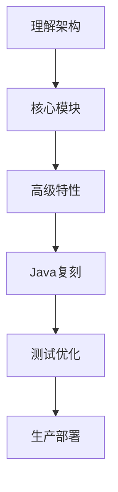

# OpenClaw 代理框架学习路线图

> 为资深Java开发者准备的学习指南,帮助理解OpenClaw架构并用Java复刻

## 📋 项目概览

**OpenClaw** 是一个个人AI助手框架,具有以下核心特点:

- **多渠道支持**: WhatsApp、Telegram、Slack、Discord、Google Chat、Signal、iMessage等
- **本地优先**: Gateway作为控制平面,在本地设备上运行
- **代理运行时**: 基于Pi agent runtime,支持RPC模式
- **工具生态**: 浏览器控制、Canvas、节点管理、定时任务等
- **技术栈**: TypeScript + Node.js 22+

## 🎯 学习目标

1. 理解OpenClaw的架构设计和核心概念
2. 掌握代理框架的实现原理
3. 用Java复刻核心功能

---

## 📚 第一阶段:架构理解(1-2周)

### 1.1 核心架构组件

#### Gateway (控制平面)
**位置**: `src/gateway/`

**核心职责**:
- WebSocket控制平面 (默认端口: 18789)
- 会话管理
- 配置管理
- 事件路由
- Webhook支持

**关键文件**:
- `src/gateway/gateway.ts` - Gateway主入口
- `src/gateway/websocket.ts` - WebSocket服务器
- `src/gateway/session-manager.ts` - 会话管理器

**Java复刻要点**:
```java
// 使用Spring Boot + WebSocket
@Configuration
@EnableWebSocket
public class GatewayConfig implements WebSocketConfigurer {
    @Override
    public void registerWebSocketHandlers(WebSocketHandlerRegistry registry) {
        registry.addHandler(new GatewayWebSocketHandler(), "/gateway")
                .setAllowedOrigins("*");
    }
}
```

#### Agent Runtime (代理运行时)
**位置**: `src/agents/`

**核心依赖**:
- `@mariozechner/pi-agent-core` - Pi代理核心
- `@mariozechner/pi-ai` - AI集成
- `@mariozechner/pi-coding-agent` - 编码代理

**关键概念**:
- RPC模式通信
- 工具流式传输
- 块流式传输

**Java复刻要点**:
```java
// 使用gRPC或自定义RPC框架
public interface AgentRuntime {
    CompletableFuture<AgentResponse> execute(AgentRequest request);
    Stream<ToolEvent> streamTools();
    Stream<BlockEvent> streamBlocks();
}
```

#### Channels (渠道系统)
**位置**: `src/channels/`, `src/telegram/`, `src/discord/`, `src/slack/`等

**核心功能**:
- 多渠道消息路由
- 统一消息抽象
- 渠道特定适配器

**Java复刻要点**:
```java
// 使用适配器模式
public interface ChannelAdapter {
    void sendMessage(String channelId, Message message);
    Stream<IncomingMessage> receiveMessages();
    ChannelType getType();
}

public class TelegramAdapter implements ChannelAdapter {
    // Telegram特定实现
}
```

### 1.2 关键设计模式

#### 1. 依赖注入
**位置**: `src/infra/`

OpenClaw使用`createDefaultDeps()`模式进行依赖注入。

**Java复刻**:
```java
// 使用Spring的依赖注入
@Configuration
public class DependencyConfig {
    @Bean
    public GatewayService gatewayService(
        SessionManager sessionManager,
        ChannelRouter channelRouter) {
        return new GatewayService(sessionManager, channelRouter);
    }
}
```

#### 2. 事件驱动架构
**位置**: `src/routing/`

消息路由和事件处理采用事件驱动模式。

**Java复刻**:
```java
// 使用Spring Events或自定义事件总线
@Component
public class MessageEventPublisher {
    @Autowired
    private ApplicationEventPublisher eventPublisher;
    
    public void publishMessage(MessageEvent event) {
        eventPublisher.publishEvent(event);
    }
}

@Component
public class MessageEventListener {
    @EventListener
    public void handleMessage(MessageEvent event) {
        // 处理消息
    }
}
```

#### 3. 插件系统
**位置**: `extensions/`, `src/plugins/`

支持动态加载和管理插件。

**Java复刻**:
```java
// 使用Java SPI或自定义插件加载器
public interface Plugin {
    void initialize(PluginContext context);
    void shutdown();
    PluginMetadata getMetadata();
}

public class PluginManager {
    private Map<String, Plugin> plugins = new HashMap<>();
    
    public void loadPlugin(Path pluginPath) {
        // 使用ClassLoader动态加载
    }
}
```

---

## 📚 第二阶段:核心模块深入(2-3周)

### 2.1 会话管理
**位置**: `src/sessions/`

**核心概念**:
- 主会话 (main session) - 直接对话
- 群组会话 - 群组隔离
- 会话激活模式
- 队列模式

**关键文件**:
```
src/sessions/session.ts
src/sessions/session-store.ts
src/sessions/session-pruning.ts
```

**Java实现示例**:
```java
@Entity
public class Session {
    @Id
    private String sessionId;
    
    @Enumerated(EnumType.STRING)
    private SessionType type; // MAIN, GROUP
    
    @Enumerated(EnumType.STRING)
    private ActivationMode activationMode; // MENTION, ALWAYS
    
    private LocalDateTime createdAt;
    private LocalDateTime lastActiveAt;
    
    @OneToMany(mappedBy = "session", cascade = CascadeType.ALL)
    private List<Message> messages;
}

@Service
public class SessionManager {
    @Autowired
    private SessionRepository sessionRepository;
    
    public Session getOrCreateSession(String channelId, String userId) {
        return sessionRepository.findByChannelAndUser(channelId, userId)
            .orElseGet(() -> createNewSession(channelId, userId));
    }
    
    public void pruneInactiveSessions(Duration inactivityThreshold) {
        // 会话修剪逻辑
    }
}
```

### 2.2 消息路由
**位置**: `src/routing/`

**核心功能**:
- 渠道路由
- 重试策略
- 流式传输和分块

**Java实现示例**:
```java
@Component
public class MessageRouter {
    private final Map<ChannelType, ChannelAdapter> adapters;
    private final RetryPolicy retryPolicy;
    
    public void routeMessage(Message message) {
        ChannelAdapter adapter = adapters.get(message.getChannelType());
        
        Failsafe.with(retryPolicy)
            .run(() -> adapter.sendMessage(message.getChannelId(), message));
    }
}

@Configuration
public class RetryPolicyConfig {
    @Bean
    public RetryPolicy<Object> retryPolicy() {
        return RetryPolicy.builder()
            .withMaxRetries(3)
            .withBackoff(Duration.ofSeconds(1), Duration.ofSeconds(30))
            .build();
    }
}
```

### 2.3 工具系统
**位置**: `src/browser/`, `src/canvas-host/`, `src/node-host/`

**核心工具**:
1. **浏览器控制** - Playwright集成
2. **Canvas** - A2UI推送/重置
3. **节点管理** - 相机、屏幕录制、通知

**Java实现思路**:
```java
public interface Tool {
    String getName();
    ToolSchema getSchema();
    CompletableFuture<ToolResult> execute(ToolInput input);
}

@Component
public class BrowserTool implements Tool {
    private final PlaywrightService playwright;
    
    @Override
    public CompletableFuture<ToolResult> execute(ToolInput input) {
        return CompletableFuture.supplyAsync(() -> {
            // 使用Playwright Java库
            Browser browser = playwright.chromium().launch();
            Page page = browser.newPage();
            // 执行浏览器操作
            return new ToolResult(/* 结果 */);
        });
    }
}
```

### 2.4 配置管理
**位置**: `src/config/`

**配置层级**:
1. 默认配置
2. 用户配置 (`~/.openclaw/openclaw.json`)
3. 环境变量

**Java实现**:
```java
@Configuration
@ConfigurationProperties(prefix = "openclaw")
public class OpenClawConfig {
    private GatewayConfig gateway;
    private AgentConfig agent;
    private Map<String, ChannelConfig> channels;
    
    // Getters and setters
}

@Component
public class ConfigManager {
    @Value("${user.home}")
    private String userHome;
    
    public OpenClawConfig loadConfig() {
        Path configPath = Paths.get(userHome, ".openclaw", "openclaw.json");
        // 加载和合并配置
        return mergeConfigs(defaultConfig, userConfig, envConfig);
    }
}
```

---

## 📚 第三阶段:高级特性(2-3周)

### 3.1 安全模型
**位置**: `src/security/`, `src/pairing/`

**核心特性**:
- DM配对机制
- 沙箱模式 (Docker)
- 权限管理

**Java实现**:
```java
@Service
public class SecurityService {
    @Autowired
    private PairingStore pairingStore;
    
    public boolean isAuthorized(String channelId, String userId) {
        return pairingStore.isPaired(channelId, userId);
    }
    
    public String generatePairingCode(String channelId, String userId) {
        String code = RandomStringUtils.randomAlphanumeric(6);
        pairingStore.savePendingPairing(channelId, userId, code);
        return code;
    }
    
    public boolean approvePairing(String channelId, String code) {
        return pairingStore.approvePairing(channelId, code);
    }
}
```

### 3.2 模型集成
**位置**: `src/providers/`

**支持的模型**:
- Anthropic (Claude)
- OpenAI (GPT)
- 模型故障转移

**Java实现**:
```java
public interface ModelProvider {
    CompletableFuture<ModelResponse> complete(ModelRequest request);
    boolean isAvailable();
}

@Component
public class AnthropicProvider implements ModelProvider {
    @Value("${anthropic.api-key}")
    private String apiKey;
    
    private final WebClient webClient;
    
    @Override
    public CompletableFuture<ModelResponse> complete(ModelRequest request) {
        return webClient.post()
            .uri("https://api.anthropic.com/v1/messages")
            .header("x-api-key", apiKey)
            .bodyValue(request)
            .retrieve()
            .bodyToMono(ModelResponse.class)
            .toFuture();
    }
}

@Service
public class ModelFailoverService {
    private final List<ModelProvider> providers;
    
    public CompletableFuture<ModelResponse> complete(ModelRequest request) {
        return providers.stream()
            .filter(ModelProvider::isAvailable)
            .findFirst()
            .orElseThrow(() -> new NoAvailableModelException())
            .complete(request);
    }
}
```

### 3.3 定时任务和Webhook
**位置**: `src/cron/`, `src/gateway/webhook.ts`

**Java实现**:
```java
@Configuration
@EnableScheduling
public class CronConfig {
    @Scheduled(cron = "${openclaw.cron.expression}")
    public void scheduledTask() {
        // 定时任务逻辑
    }
}

@RestController
@RequestMapping("/webhook")
public class WebhookController {
    @Autowired
    private MessageRouter messageRouter;
    
    @PostMapping("/{channelType}")
    public ResponseEntity<Void> handleWebhook(
        @PathVariable ChannelType channelType,
        @RequestBody WebhookPayload payload) {
        
        Message message = convertToMessage(payload);
        messageRouter.routeMessage(message);
        
        return ResponseEntity.ok().build();
    }
}
```

---

## 📚 第四阶段:Java复刻实现(4-6周)

### 4.1 技术栈选择

#### 核心框架
- **Spring Boot 3.x** - 应用框架
- **Spring WebFlux** - 响应式Web框架
- **Spring WebSocket** - WebSocket支持
- **Spring Data JPA** - 数据持久化

#### 通信和集成
- **gRPC** 或 **Spring RSocket** - RPC通信
- **Apache Kafka** 或 **RabbitMQ** - 消息队列
- **Netty** - 高性能网络通信

#### 工具和库
- **Playwright Java** - 浏览器自动化
- **Jackson** - JSON处理
- **Lombok** - 减少样板代码
- **MapStruct** - 对象映射

### 4.2 项目结构

```
openclaw-java/
├── openclaw-core/              # 核心模块
│   ├── gateway/                # Gateway实现
│   ├── agent/                  # Agent运行时
│   ├── session/                # 会话管理
│   └── config/                 # 配置管理
├── openclaw-channels/          # 渠道模块
│   ├── telegram/               # Telegram适配器
│   ├── discord/                # Discord适配器
│   └── slack/                  # Slack适配器
├── openclaw-tools/             # 工具模块
│   ├── browser/                # 浏览器工具
│   ├── canvas/                 # Canvas工具
│   └── node/                   # 节点工具
├── openclaw-providers/         # 模型提供者
│   ├── anthropic/              # Anthropic集成
│   └── openai/                 # OpenAI集成
├── openclaw-plugins/           # 插件系统
│   └── api/                    # 插件API
└── openclaw-cli/               # CLI工具
```

### 4.3 实现步骤

#### 第1步:搭建基础框架(1周)
```bash
# 创建Maven多模块项目
mvn archetype:generate \
  -DgroupId=ai.openclaw \
  -DartifactId=openclaw-java \
  -DarchetypeArtifactId=maven-archetype-quickstart
```

**核心依赖**:
```xml
<dependencies>
    <!-- Spring Boot -->
    <dependency>
        <groupId>org.springframework.boot</groupId>
        <artifactId>spring-boot-starter-webflux</artifactId>
    </dependency>
    <dependency>
        <groupId>org.springframework.boot</groupId>
        <artifactId>spring-boot-starter-websocket</artifactId>
    </dependency>
    
    <!-- 数据库 -->
    <dependency>
        <groupId>org.springframework.boot</groupId>
        <artifactId>spring-boot-starter-data-jpa</artifactId>
    </dependency>
    <dependency>
        <groupId>com.h2database</groupId>
        <artifactId>h2</artifactId>
    </dependency>
    
    <!-- 工具库 -->
    <dependency>
        <groupId>org.projectlombok</groupId>
        <artifactId>lombok</artifactId>
    </dependency>
    <dependency>
        <groupId>com.fasterxml.jackson.core</groupId>
        <artifactId>jackson-databind</artifactId>
    </dependency>
</dependencies>
```

#### 第2步:实现Gateway(1-2周)
1. WebSocket服务器
2. 会话管理器
3. 配置加载器
4. 事件路由器

#### 第3步:实现渠道适配器(1-2周)
1. 定义统一的Channel接口
2. 实现Telegram适配器
3. 实现Discord适配器
4. 实现消息路由

#### 第4步:实现Agent运行时(1-2周)
1. RPC通信框架
2. 工具注册和执行
3. 流式传输支持
4. 模型集成

#### 第5步:实现工具系统(1周)
1. 浏览器工具 (Playwright)
2. 基础工具框架
3. 工具注册机制

#### 第6步:测试和优化(1周)
1. 单元测试
2. 集成测试
3. 性能优化

---

## 🔍 关键学习资源

### 官方文档
- [OpenClaw文档](https://docs.openclaw.ai)
- [架构概览](https://docs.openclaw.ai/concepts/architecture)
- [配置参考](https://docs.openclaw.ai/gateway/configuration)

### 核心代码文件
1. **Gateway入口**: `src/gateway/gateway.ts`
2. **Agent运行时**: `src/agents/agent-runtime.ts`
3. **会话管理**: `src/sessions/session-manager.ts`
4. **消息路由**: `src/routing/message-router.ts`
5. **配置加载**: `src/config/config-loader.ts`

### 推荐阅读顺序
1. `README.md` - 项目概览
2. `AGENTS.md` - 开发指南
3. `src/entry.ts` - 入口点
4. `src/gateway/` - Gateway实现
5. `src/agents/` - Agent实现
6. `src/channels/` - 渠道系统

---

## 💡 学习建议

### 1. 循序渐进
- 先理解整体架构,再深入具体模块
- 从简单的模块开始(如配置管理),逐步到复杂模块(如Agent运行时)

### 2. 动手实践
- 运行OpenClaw项目,观察其行为
- 修改配置,测试不同场景
- 阅读测试文件,理解预期行为

### 3. 对比学习
- TypeScript vs Java的设计差异
- 异步编程模型的转换
- 依赖注入的实现方式

### 4. 参考现有Java框架
- **Spring AI** - AI集成框架
- **LangChain4j** - Java版LangChain
- **Quarkus** - 云原生Java框架

---

## 📝 实践任务

### 任务1:搭建最小可行版本(MVP)
**目标**: 实现一个简单的Gateway + Telegram渠道

**步骤**:
1. 创建Spring Boot项目
2. 实现WebSocket Gateway
3. 实现Telegram适配器
4. 实现简单的echo功能

### 任务2:添加会话管理
**目标**: 支持多用户会话隔离

**步骤**:
1. 设计Session实体
2. 实现SessionManager
3. 集成到消息路由

### 任务3:集成AI模型
**目标**: 接入OpenAI或Anthropic

**步骤**:
1. 实现ModelProvider接口
2. 添加API调用逻辑
3. 实现流式响应

---

## 🎓 进阶主题

### 1. 性能优化
- 使用虚拟线程 (Java 21+)
- 响应式编程 (Project Reactor)
- 连接池管理

### 2. 可观测性
- 日志聚合 (ELK Stack)
- 指标收集 (Micrometer + Prometheus)
- 分布式追踪 (OpenTelemetry)

### 3. 部署和运维
- Docker容器化
- Kubernetes编排
- CI/CD流水线

---

## 📞 获取帮助

### 社区资源
- [OpenClaw Discord](https://discord.gg/clawd)
- [GitHub Issues](https://github.com/openclaw/openclaw/issues)
- [文档站点](https://docs.openclaw.ai)

### 学习路径总结



---

## ✅ 检查清单

- [ ] 理解Gateway的作用和实现
- [ ] 理解Agent运行时的工作原理
- [ ] 理解会话管理机制
- [ ] 理解消息路由逻辑
- [ ] 理解工具系统架构
- [ ] 实现基础Gateway
- [ ] 实现至少一个渠道适配器
- [ ] 实现会话管理
- [ ] 集成AI模型
- [ ] 实现基础工具
- [ ] 编写测试用例
- [ ] 完成MVP部署

---

**祝学习顺利!如有问题,随时提问。** 🚀
