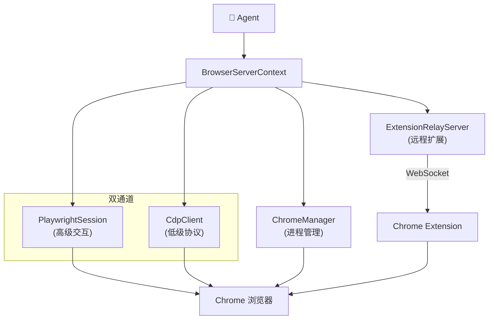
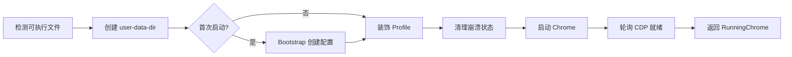
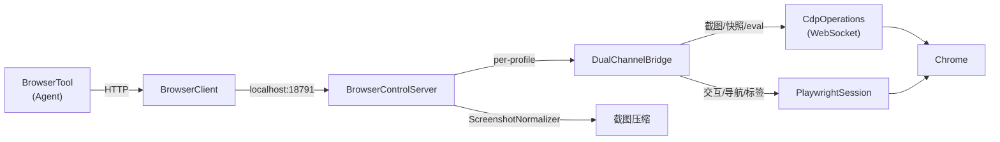
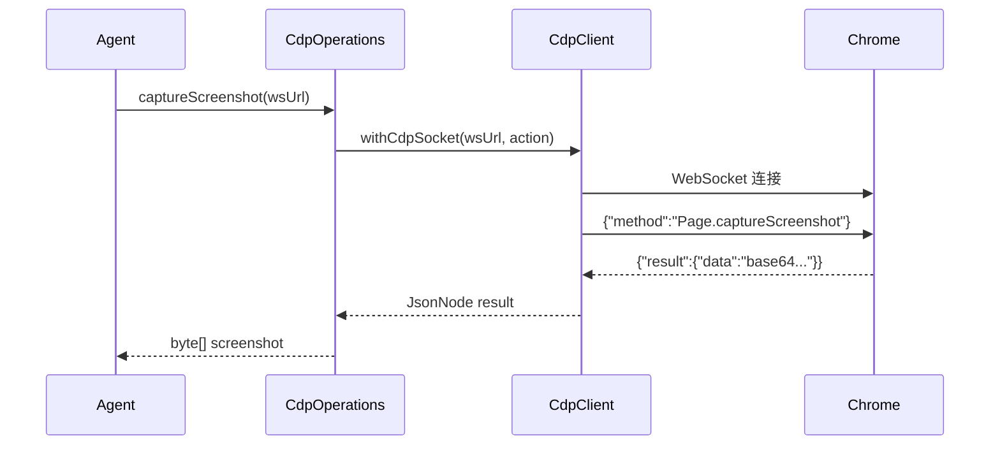
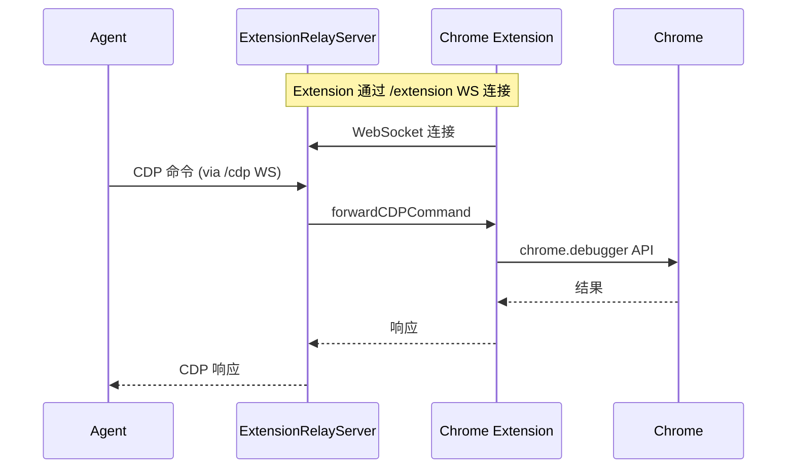

# Browser 模块指南

> **openclaw-browser** — AI Agent 的浏览器自动化能力层，采用 **CDP 直连 + Playwright** 双通道架构。

## 架构概览



### 为什么需要双通道？

| 通道           | 优势                           | 适用场景                             |
| -------------- | ------------------------------ | ------------------------------------ |
| **CDP 直连**   | 低延迟、无依赖、协议级控制     | 截图、JS 执行、DOM/Aria 快照、新 Tab |
| **Playwright** | 高级 API、自动等待、选择器引擎 | 表单填写、点击、导航、Cookie/Storage |

两者互补：CDP 用于底层高性能操作，Playwright 用于复杂交互场景。

---

## 核心组件

### 1. CDP 直连层 (`com.openclaw.browser.cdp`)

通过 WebSocket 直接与 Chrome DevTools Protocol 通信。

```
CdpTypes      → 协议类型定义 (RemoteObject, AXNode, DomNode, ...)
CdpHelpers    → URL 拼接、fetchJson、WS 规范化、认证头
CdpClient     → WebSocket JSON-RPC 客户端 (一次性连接模式)
CdpOperations → 高级 CDP 操作封装
```

**CdpClient 使用模式** — `withCdpSocket`：

```java
// 一次性 WebSocket 连接，执行完自动关闭
CdpTypes.CdpEvalResult result = CdpClient.withCdpSocket(wsUrl, send -> {
    send.send("Runtime.enable", null);
    JsonNode evalResult = send.send("Runtime.evaluate",
        mapper.createObjectNode().put("expression", "document.title"));
    return mapper.treeToValue(evalResult, CdpTypes.CdpEvalResult.class);
});
```

**CdpOperations 提供的能力**：

| 方法                 | 说明             |
| -------------------- | ---------------- |
| `captureScreenshot`  | 截图（PNG/JPEG） |
| `evaluateJavaScript` | 执行 JS 表达式   |
| `snapshotAria`       | 获取无障碍树     |
| `snapshotDom`        | 获取 DOM 快照    |
| `getDomText`         | 提取 HTML/纯文本 |
| `querySelector`      | CSS 选择器查询   |
| `createTarget`       | 创建新标签页     |

### 2. Chrome 进程管理 (`com.openclaw.browser.chrome`)

自动检测、启动和管理 Chrome 浏览器实例。

```
ChromeExecutables       → 跨平台可执行文件检测 (macOS/Linux)
ChromeManager           → 启动/停止/就绪检测
ChromeProfileDecoration → Profile 品牌化 + 崩溃恢复
RunningChrome           → 运行实例状态
```

**启动流程**：



**可执行文件检测优先级**（macOS）：

1. 用户配置的路径
2. 系统默认浏览器（通过 Bundle ID）
3. 已知路径扫描（Chrome → Canary → Brave → Edge → Chromium）

### 3. Extension Relay (`com.openclaw.browser.relay`)

Netty 实现的 WebSocket 代理服务器，让 Chrome Extension 可以转发 CDP 命令。

```
ExtensionRelayTypes   → 协议消息类型 (与 TS Chrome Extension 兼容)
ExtensionRelayServer  → HTTP + WebSocket 代理
ExtensionRelayManager → 端口→实例单例管理
```

**Relay 端点**：

| 路径                | 协议      | 连接方                  | 说明             |
| ------------------- | --------- | ----------------------- | ---------------- |
| `/extension`        | WebSocket | Chrome Extension        | 扩展连接入口     |
| `/cdp`              | WebSocket | CDP Client / Playwright | CDP 客户端入口   |
| `/json/version`     | HTTP      | 任意                    | Chrome 版本信息  |
| `/json/list`        | HTTP      | 任意                    | 已连接标签页列表 |
| `/extension/status` | HTTP      | 任意                    | 扩展连接状态     |

**安全机制**：

- 仅接受 loopback 连接
- `/cdp` 和 `/json/*` 需要 `x-openclaw-relay-token` 认证
- Origin 检查：仅允许 `chrome-extension://` 来源

### 4. Playwright 工具集 (`com.openclaw.browser.playwright`)

基于 Playwright Java 的高级浏览器交互。

```
PlaywrightSession → 持久 CDP 连接、Page 管理、状态跟踪
PwToolsCore       → 交互/快照/状态/导航/下载/追踪
```

**PlaywrightSession 管理**：

```java
PlaywrightSession session = new PlaywrightSession(config);
session.connect(profile);  // 通过 CDP URL 连接

Page page = session.ensurePage();
PwToolsCore.click(page, "#submit", null);
PwToolsCore.fill(page, "input[name='email']", "user@example.com");

byte[] screenshot = session.screenshot(false);
session.close();
```

**PwToolsCore 能力矩阵**：

| 类别   | 方法                                                                        |
| ------ | --------------------------------------------------------------------------- |
| 交互   | `click`, `type`, `fill`, `press`, `focus`, `hover`, `check`, `selectOption` |
| 导航   | `navigate`, `goBack`, `goForward`, `reload`                                 |
| 快照   | `getAccessibilitySnapshot`, `getPageContent`, `getPageText`                 |
| 状态   | `getCookies`, `clearCookies`, `getLocalStorage`, `setLocalStorage`          |
| 追踪   | `startTracing`, `stopTracing`, `trackPageState`                             |
| 下载   | `waitForDownload`, `saveDownload`                                           |
| 对话框 | `acceptDialog`, `dismissDialog`                                             |

### 7. 双通道接线 (`com.openclaw.browser.server.DualChannelBridge`)

连接 CDP 和 Playwright 通道的智能路由层。每个 Profile 对应一个 Bridge 实例。

```
DualChannelBridge → 每个 Profile 一个实例
  ├── CDP 直连 (cdpWsUrl)   → 截图 / 快照 / JS 评估
  └── Playwright (session)  → 交互 / 导航 / 标签管理
```

**路由策略**：

| 操作                     | 首选通道   | 回退通道   | 原因                     |
| ------------------------ | ---------- | ---------- | ------------------------ |
| 截图（viewport）         | **CDP**    | Playwright | CDP 延迟更低             |
| 截图（fullPage/element） | Playwright | —          | CDP 不支持 fullPage      |
| Aria 快照                | **CDP**    | Playwright | CDP 直接获取 AX Tree     |
| JS 执行                  | **CDP**    | Playwright | 协议级精确控制           |
| 点击/输入/填表           | Playwright | —          | Playwright 有 auto-wait  |
| 导航                     | Playwright | —          | 更丰富的 wait 机制       |
| 标签管理                 | Playwright | —          | Playwright 原生 API      |
| Console 消息             | Playwright | —          | 通过 event listener 收集 |

---

## 接线架构

### 完整调用链



### 接线工作原理

1. **浏览器启动时** — `BrowserControlServer.handleStart()` 创建 `DualChannelBridge`，自动发现 CDP WebSocket URL

2. **截图请求** — `handleScreenshot()` 通过 Bridge 路由：
   - 若 CDP 可用且是 viewport 截图 → CDP 直连截图 + `ScreenshotNormalizer` 压缩
   - 否则 → Playwright 截图 + `ScreenshotNormalizer` 压缩

3. **快照请求** — `handleSnapshot()` 通过 Bridge 路由：
   - 若 CDP 可用 → `CdpOperations.snapshotAria()` 获取无障碍树
   - 否则 → `PlaywrightSession.snapshot()` (ariaSnapshot)

4. **交互请求** — `handleAct()` 直接走 Playwright（auto-wait 机制更可靠）

5. **通道状态查询** — `GET /channels?profile=xxx` 返回双通道状态

### 响应中的通道标识

所有截图和快照请求的响应都包含 `channel` 字段：

```json
{
  "ok": true,
  "data": "base64...",
  "channel": "cdp", // 或 "playwright"
  "contentType": "image/png"
}
```

这让调用者（Agent/用户）可以知道实际使用了哪个通道。

---

## 目录结构

```
openclaw-browser/src/main/java/com/openclaw/browser/
├── BrowserConfig.java           # 配置解析
├── BrowserConstants.java        # 常量定义
├── BrowserControlServer.java    # HTTP 控制服务器 (集成 DualChannelBridge)
├── BrowserProfiles.java         # Profile 管理
├── BrowserTypes.java            # 公共类型
├── PlaywrightSession.java       # Playwright 核心会话
├── cdp/                         # CDP 直连层
│   ├── CdpTypes.java
│   ├── CdpHelpers.java
│   ├── CdpClient.java
│   └── CdpOperations.java
├── chrome/                      # Chrome 进程管理
│   ├── RunningChrome.java
│   ├── ChromeExecutables.java
│   ├── ChromeProfileDecoration.java
│   └── ChromeManager.java
├── relay/                       # Extension Relay
│   ├── ExtensionRelayTypes.java
│   ├── ExtensionRelayServer.java
│   └── ExtensionRelayManager.java
├── playwright/                  # Playwright 工具扩展
│   ├── PlaywrightSession.java   # 增强版会话
│   └── PwToolsCore.java
├── screenshot/                  # 截图优化
│   └── ScreenshotNormalizer.java
└── server/                      # 服务端
    ├── BrowserServerContext.java
    └── DualChannelBridge.java   # ← 双通道接线
```

Browser 配置通过 `openclaw.yml` 的 `browser` 段：

```yaml
browser:
  enabled: true
  evaluateEnabled: true
  controlPort: 18791
  headless: false
  noSandbox: false
  attachOnly: false
  color: "#4A90D9"
  defaultProfile: openclaw

  # 多 Profile 支持
  profiles:
    work:
      cdpPort: 9223
      color: "#FF6B35"
    research:
      cdpUrl: "http://127.0.0.1:9224"
      color: "#2ECC71"
```

### 配置项说明

| 配置项            | 默认值     | 说明                    |
| ----------------- | ---------- | ----------------------- |
| `enabled`         | `true`     | 是否启用 Browser 模块   |
| `evaluateEnabled` | `true`     | 是否允许 JS 执行        |
| `controlPort`     | `18791`    | 控制服务器端口          |
| `headless`        | `false`    | 无头模式                |
| `noSandbox`       | `false`    | 禁用沙箱（Docker 环境） |
| `attachOnly`      | `false`    | 仅连接不启动            |
| `color`           | `#4A90D9`  | Profile 主题色          |
| `defaultProfile`  | `openclaw` | 默认 Profile 名称       |

---

## 数据流

### CDP 直连模式



### Extension Relay 模式



---

## 目录结构

```
openclaw-browser/src/main/java/com/openclaw/browser/
├── BrowserConfig.java           # 配置解析
├── BrowserConstants.java        # 常量定义
├── BrowserControlServer.java    # HTTP 控制服务器
├── BrowserProfiles.java         # Profile 管理
├── BrowserTypes.java            # 公共类型
├── cdp/                         # CDP 直连层
│   ├── CdpTypes.java
│   ├── CdpHelpers.java
│   ├── CdpClient.java
│   └── CdpOperations.java
├── chrome/                      # Chrome 进程管理
│   ├── RunningChrome.java
│   ├── ChromeExecutables.java
│   ├── ChromeProfileDecoration.java
│   └── ChromeManager.java
├── relay/                       # Extension Relay
│   ├── ExtensionRelayTypes.java
│   ├── ExtensionRelayServer.java
│   └── ExtensionRelayManager.java
├── playwright/                  # Playwright 工具
│   ├── PlaywrightSession.java
│   └── PwToolsCore.java
├── screenshot/                  # 截图优化
│   └── ScreenshotNormalizer.java
└── server/                      # 服务端上下文
    └── BrowserServerContext.java
```

---

## 常见用法

### 1. 截图

```java
// CDP 方式 (低延迟)
byte[] png = CdpOperations.captureScreenshotPng(wsUrl);

// Playwright 方式 (更多选项)
byte[] jpeg = session.screenshotJpeg(true, 80);

// 自适应压缩
byte[] optimized = ScreenshotNormalizer.normalize(png);
```

### 2. JS 执行

```java
CdpTypes.CdpEvalResult result = CdpOperations.evaluateJavaScript(
    wsUrl, "document.title", true, true);
System.out.println(result.value()); // 页面标题
```

### 3. DOM 查询

```java
List<CdpTypes.QueryMatch> matches = CdpOperations.querySelector(
    wsUrl, "a.nav-link");
```

### 4. 页面交互

```java
Page page = session.ensurePage();
PwToolsCore.navigate(page, "https://example.com", 30000);
PwToolsCore.fill(page, "#search", "openclaw");
PwToolsCore.click(page, "button[type=submit]", null);
PwToolsCore.waitForSelector(page, ".results", 5000);
String text = PwToolsCore.getPageText(page);
```

### 5. Extension Relay

```java
// 确保 relay 运行
ExtensionRelayServer relay = ExtensionRelayManager.ensureRelayServer(
    "http://127.0.0.1:9222");

// 等待 Extension 连接
while (!relay.isExtensionConnected()) {
    Thread.sleep(500);
}

// 后续 CDP/Playwright 连接自动携带 relay auth
Map<String, String> headers = CdpHelpers.getAuthHeaders(
    "http://127.0.0.1:9222");
```
