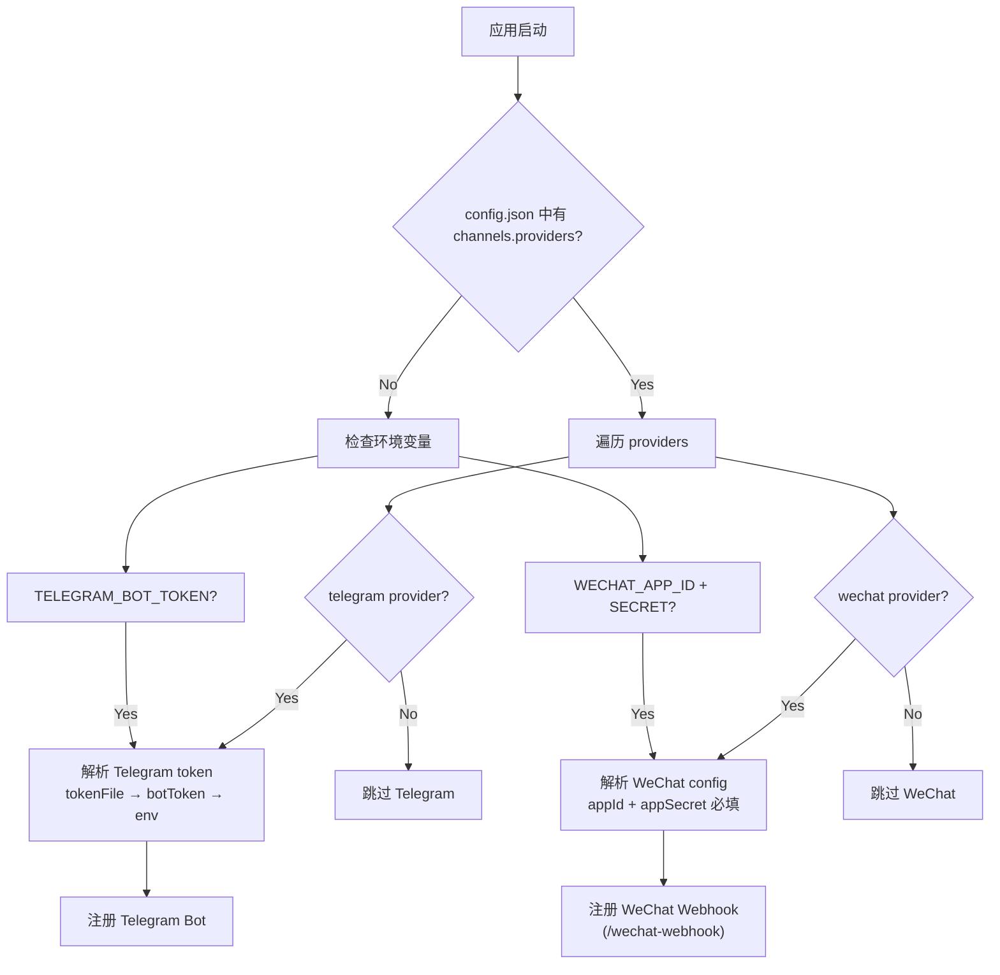

# 渠道配置文档 / Channel Configuration Guide

OpenClaw 支持通过 `config.json` 或**环境变量**配置消息渠道。每个渠道在 `channels.providers` 下以 provider 名称（如 `telegram`、`wechat`）作为 key 进行注册。

---

## Telegram

### 配置方式

Telegram 支持三种 token 来源（优先级从高到低）：

| 优先级 | 来源 | 字段 / 变量 |
|--------|------|-------------|
| 1 | 账户级 token 文件 | `channels.telegram.accounts.<id>.tokenFile` |
| 2 | 账户级 botToken | `channels.telegram.accounts.<id>.botToken` |
| 3 | 全局 token 文件 | `channels.telegram.tokenFile` |
| 4 | 全局 botToken | `channels.telegram.botToken` |
| 5 | 环境变量 | `TELEGRAM_BOT_TOKEN` |

### config.json 示例

```json
{
  "channels": {
    "telegram": {
      "botToken": "123456:ABC-DEF1234ghIkl-zyx57W2v1u123ew11",
      "accountId": "default",
      "accounts": {
        "default": {
          "botToken": "123456:ABC-DEF1234ghIkl-zyx57W2v1u123ew11"
        },
        "secondary": {
          "botToken": "789012:XYZ-GHI5678jklMn-abc90P3q4r567st89",
          "tokenFile": "/path/to/secondary-token.txt"
        }
      }
    }
  }
}
```

### 环境变量

| 变量 | 说明 | 默认值 |
|------|------|--------|
| `TELEGRAM_BOT_TOKEN` | Bot Token（最低优先级） | — |
| `HTTPS_PROXY` | HTTPS 代理地址 | — |
| `HTTP_PROXY` | HTTP 代理地址 | — |
| `ALL_PROXY` | 通用代理地址 | — |
| `OPENCLAW_TELEGRAM_AUTO_SELECT_FAMILY` | IPv4/IPv6 自动选择 (`true`/`false`) | `null` |

### 网络配置

可在 `channels.telegram` 下添加网络相关参数：

```json
{
  "channels": {
    "telegram": {
      "botToken": "...",
      "connectTimeoutMs": 30000,
      "readTimeoutMs": 60000,
      "autoSelectFamily": true
    }
  }
}
```

| 字段 | 类型 | 默认值 | 说明 |
|------|------|--------|------|
| `connectTimeoutMs` | `number` | `30000` | 连接超时（毫秒） |
| `readTimeoutMs` | `number` | `60000` | 读取超时（毫秒） |
| `autoSelectFamily` | `boolean` | `null` | IPv4/IPv6 自动选择 |

### 代理

代理按以下优先级从环境变量读取：`HTTPS_PROXY` → `HTTP_PROXY` → `ALL_PROXY`。设置后会自动应用到 JVM 系统属性 `https.proxyHost/Port` 和 `http.proxyHost/Port`。

### 最小配置

仅需一个环境变量即可启动 Telegram：

```bash
export TELEGRAM_BOT_TOKEN="123456:ABC-DEF1234ghIkl-zyx57W2v1u123ew11"
```

---

## WeChat（微信公众号）

### 配置方式

WeChat 支持 config.json 配置 + 环境变量 fallback：

| 字段 | config.json key | 环境变量 fallback | 必填 |
|------|-----------------|-------------------|------|
| App ID | `appId` | `WECHAT_APP_ID` | ✅ |
| App Secret | `appSecret` | `WECHAT_APP_SECRET` | ✅ |
| 验证 Token | `token` | `WECHAT_TOKEN` | ⚠️ 推荐 |
| 加密 AES Key | `encodingAesKey` | `WECHAT_ENCODING_AES_KEY` | ❌ 可选 |

> [!IMPORTANT]
> `appId` 和 `appSecret` 是必填项。缺少任一项将跳过 WeChat 初始化。
> `token` 用于 Webhook 签名验证。未配置时默认为空字符串，但**强烈建议配置**以保证安全性。

### config.json 示例

```json
{
  "channels": {
    "wechat": {
      "appId": "wx1234567890abcdef",
      "appSecret": "your_app_secret_here",
      "token": "your_webhook_verify_token",
      "encodingAesKey": "43_char_aes_key_for_message_encryption_here"
    }
  }
}
```

### 环境变量

| 变量 | 说明 | 必填 |
|------|------|------|
| `WECHAT_APP_ID` | 微信公众号 App ID | ✅（若 config 未配） |
| `WECHAT_APP_SECRET` | 微信公众号 App Secret | ✅（若 config 未配） |
| `WECHAT_TOKEN` | Webhook 签名验证 Token | ⚠️ 推荐 |
| `WECHAT_ENCODING_AES_KEY` | 消息加密 AES Key（43 位） | ❌ 可选 |

### Webhook 端点

WeChat 配置成功后，会注册以下 HTTP 端点：

| 方法 | 路径 | 用途 |
|------|------|------|
| `GET` | `/wechat-webhook` | URL 验证（返回 echostr） |
| `POST` | `/wechat-webhook` | 接收用户消息（XML 格式） |

在微信公众平台后台配置服务器 URL 时，填写：

```
https://your-domain.com/wechat-webhook
```

### 支持的消息类型

| 消息类型 | 处理方式 |
|----------|----------|
| `text` 文本消息 | 返回被动回复 XML |
| `image` 图片消息 | 返回确认提示 |
| `voice` 语音消息 | 有识别结果时转为文本处理；无识别结果时返回提示 |
| `event:subscribe` 关注事件 | 返回欢迎词 |
| `event:unsubscribe` 取关事件 | 静默处理 |
| 其他类型 | 返回 `"success"`（无回复） |

### 最小配置

```bash
export WECHAT_APP_ID="wx1234567890abcdef"
export WECHAT_APP_SECRET="your_app_secret_here"
export WECHAT_TOKEN="your_verify_token"
```

---

## 完整配置示例

同时启用 Telegram 和 WeChat：

```json
{
  "channels": {
    "telegram": {
      "botToken": "123456:ABC-DEF1234ghIkl-zyx57W2v1u123ew11"
    },
    "wechat": {
      "appId": "wx1234567890abcdef",
      "appSecret": "your_app_secret_here",
      "token": "your_webhook_verify_token"
    }
  }
}
```

或纯环境变量方式：

```bash
# Telegram
export TELEGRAM_BOT_TOKEN="123456:ABC-DEF1234ghIkl-zyx57W2v1u123ew11"

# WeChat
export WECHAT_APP_ID="wx1234567890abcdef"
export WECHAT_APP_SECRET="your_app_secret_here"
export WECHAT_TOKEN="your_verify_token"
```

> [!TIP]
> 配置文件中的值优先级高于环境变量。两者可混合使用——例如 config.json 中设置 Telegram，环境变量中设置 WeChat。

---

## 配置解析流程


