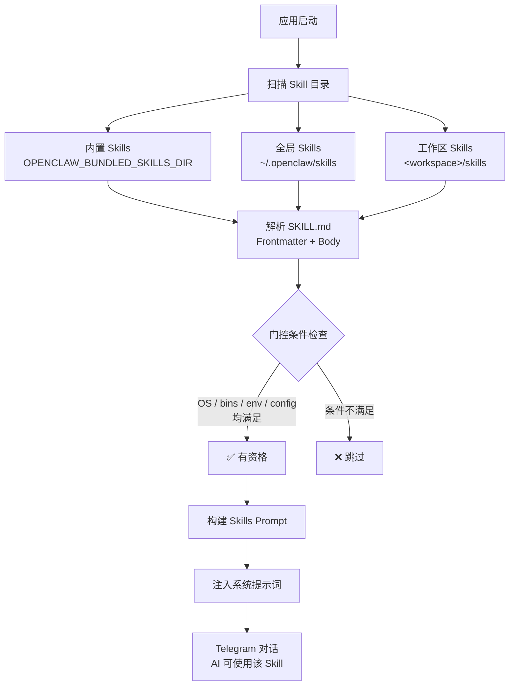

# Skills 使用指南

OpenClaw 通过 **Skills** 机制扩展 AI 助手的能力。每个 Skill 是一个包含 `SKILL.md` 文件的目录，里面定义了技能的名称、描述、使用条件和详细指令。Skills 在启动时自动加载并注入到系统提示词中，让 AI 助手"学会"使用特定工具和执行特定任务。

---

## 快速开始

### 1. 创建自定义 Skill

在工作区下创建 `skills/<skill-name>/SKILL.md`：

```
skills/
└── my-translator/
    └── SKILL.md
```

`SKILL.md` 最小示例：

```markdown
---
name: my-translator
description: 将用户输入的文本翻译为指定语言
---

# 翻译助手

当用户要求翻译时，使用以下规则：
1. 自动检测源语言
2. 默认翻译为中文，除非用户指定其他目标语言
3. 保留原文格式（代码块、列表等）
```

### 2. 在 Telegram 中使用

启动 OpenClaw 后，在 Telegram 对话中直接使用即可——**不需要任何特殊命令**。Skills 会自动被 AI 识别并在合适的场景下激活。

```
用户: 帮我把这段英文翻译成日语：Hello, how are you?
Bot:  こんにちは、お元気ですか？
```

如果 Skill 配置了 `user-invocable: true`（默认），还可以通过斜杠命令直接调用：

```
用户: /skill my-translator 将 "Good morning" 翻译成法语
Bot:  Bonjour
```

---

## Skill 目录和优先级

Skills 从以下位置加载，名称冲突时按优先级覆盖：

| 优先级 | 位置 | 说明 |
|--------|------|------|
| 🔴 最高 | `<workspace>/skills/` | 工作区自定义 Skills |
| 🟡 中 | `~/.openclaw/skills/` | 全局共享 Skills |
| 🟢 最低 | 内置 Skills（随发行包） | 系统预置 Skills |

> [!TIP]
> 可通过环境变量 `OPENCLAW_BUNDLED_SKILLS_DIR` 自定义内置 Skills 的路径。

---

## SKILL.md 格式详解

### Frontmatter 字段

```markdown
---
name: nano-banana-pro
description: 通过 Gemini 生成或编辑图片
user-invocable: true
disable-model-invocation: false
command-dispatch: tool
command-tool: generate_image
command-arg-mode: raw
metadata: { "openclaw": { "requires": { "bins": ["uv"], "env": ["GEMINI_API_KEY"] }, "primaryEnv": "GEMINI_API_KEY", "emoji": "🎨", "os": ["darwin", "linux"] } }
---
```

| 字段 | 类型 | 默认值 | 说明 |
|------|------|--------|------|
| `name` | string | **必填** | Skill 名称（通常与目录名一致） |
| `description` | string | **必填** | 简短描述，注入到系统提示词 |
| `user-invocable` | bool | `true` | 是否作为用户斜杠命令暴露 |
| `disable-model-invocation` | bool | `false` | 为 `true` 时从模型提示词中排除 |
| `command-dispatch` | string | — | 设为 `tool` 时，斜杠命令直接调度到工具 |
| `command-tool` | string | — | 配合 `command-dispatch: tool` 使用 |
| `command-arg-mode` | string | `raw` | 参数传递模式 |
| `metadata` | JSON | — | 门控条件和扩展元数据（见下文） |

### Metadata 门控条件

`metadata` 中的 `openclaw` 对象控制 Skill 的加载条件：

```json
{
  "openclaw": {
    "always": false,
    "emoji": "🔧",
    "homepage": "https://example.com",
    "os": ["darwin", "linux"],
    "primaryEnv": "MY_API_KEY",
    "requires": {
      "bins": ["ffmpeg"],
      "anyBins": ["chrome", "chromium"],
      "env": ["MY_API_KEY"],
      "config": ["browser.enabled"]
    }
  }
}
```

| 门控字段 | 说明 |
|----------|------|
| `always: true` | 始终加载，跳过其他条件检查 |
| `os` | 操作系统过滤：`darwin`、`linux`、`win32` |
| `requires.bins` | PATH 中必须存在**全部**二进制 |
| `requires.anyBins` | PATH 中存在**任一**二进制即可 |
| `requires.env` | 必须设置的环境变量（或在配置中提供） |
| `requires.config` | `openclaw.json` 中必须为真值的配置路径 |
| `primaryEnv` | 与 `skills.entries.<name>.apiKey` 关联的环境变量 |

### Body 内容

Frontmatter 之后的 Markdown 内容是 Skill 的**详细指令**，会被完整注入到系统提示词。在这里你可以：

- 描述详细的使用规则和步骤
- 指定工具调用格式和参数
- 定义输出格式要求
- 使用 `{baseDir}` 引用 Skill 所在目录路径

---

## 配置覆盖

### 在 openclaw.json 中配置

通过 `skills.entries` 可以为每个 Skill 单独配置：

```json
{
  "skills": {
    "entries": {
      "my-translator": {
        "enabled": true,
        "apiKey": "sk-xxx",
        "env": {
          "TRANSLATOR_API_KEY": "sk-xxx"
        }
      },
      "unused-skill": {
        "enabled": false
      }
    },
    "allowBundled": ["web-search", "image-gen"]
  }
}
```

| 配置项 | 说明 |
|--------|------|
| `enabled` | `false` 强制禁用该 Skill |
| `apiKey` | 为 `primaryEnv` 声明的环境变量提供值 |
| `env` | 注入环境变量（仅在未设置时生效） |
| `allowBundled` | 内置 Skills 白名单（不影响自定义 Skills） |

### 环境变量注入流程

每次 AI 对话运行时：

1. 加载并过滤所有 Skills
2. 为符合条件的 Skill 注入 `env` 和 `apiKey` 到进程环境
3. 构建系统提示词（包含所有有资格的 Skill 指令）
4. 运行结束后恢复原始环境

---

## 在 Telegram 中的使用场景

### 场景一：AI 自动匹配 Skill

最常见的用法——直接对话，AI 根据上下文自动使用合适的 Skill：

```
用户: 帮我搜索一下最近的 Rust 2026 新特性
Bot:  [AI 自动使用 web-search skill，返回搜索结果摘要]
```

### 场景二：通过 /skill 命令显式调用

```
用户: /skill image-gen 一只在月球上的橘猫
Bot:  [直接调度到图片生成工具]
```

### 场景三：工具直接调度

如果 Skill 配置了 `command-dispatch: tool`，斜杠命令会绕过 AI 直接调用工具，响应更快：

```yaml
# SKILL.md frontmatter
command-dispatch: tool
command-tool: generate_image
```

```
用户: /image-gen 星空下的城堡
Bot:  [直接调用 generate_image 工具，无需经过 AI 推理]
```

---

## 热重载

OpenClaw 支持 Skills 文件监视。修改 `SKILL.md` 后，下一轮对话会自动使用更新后的内容，**无需重启服务**。

配置项（在 `openclaw.json` 中）：

```json
{
  "skills": {
    "load": {
      "watch": true,
      "watchDebounceMs": 250
    }
  }
}
```

---

## 实用示例

### 示例 1：代码审查 Skill

```markdown
---
name: code-review
description: 对代码进行详细审查，发现潜在问题和改进建议
---

# 代码审查

当用户请求代码审查时：

1. **安全性检查**：SQL 注入、XSS、硬编码密钥
2. **性能分析**：N+1 查询、不必要的循环、内存泄漏
3. **代码风格**：命名规范、注释完整度、函数粒度
4. **最佳实践**：错误处理、日志记录、测试覆盖

输出格式：
- 🔴 严重问题（必须修复）
- 🟡 建议优化
- 🟢 优点和亮点

逐文件分析，附带具体行号和修改建议。
```

### 示例 2：带门控条件的 Skill

```markdown
---
name: docker-helper
description: Docker 容器管理和 Compose 编排助手
metadata: { "openclaw": { "requires": { "bins": ["docker"] }, "emoji": "🐳", "os": ["darwin", "linux"] } }
---

# Docker 助手

帮助用户管理 Docker 容器、镜像和 Compose 服务。

可用操作：
- 查看运行中的容器状态
- 分析 Dockerfile 和 docker-compose.yml
- 排查容器启动失败问题
- 生成 Docker 配置建议
```

> 此 Skill 仅在 PATH 中有 `docker` 命令且系统为 macOS/Linux 时才会加载。

---

## 常见问题

| 问题 | 原因 | 解决方案 |
|------|------|----------|
| Skill 没有被 AI 使用 | 门控条件不满足 | 检查 `requires` 中的 bins/env/config 是否满足 |
| Skill 加载但 AI 忽略它 | 描述不够明确 | 重写 `description` 和 body，使触发条件更显式 |
| `/skill` 命令不生效 | `user-invocable: false` | 修改 frontmatter 或使用自然语言触发 |
| 修改 Skill 后没生效 | 未开启热重载 | 设置 `skills.load.watch: true` 或重启服务 |
| `enabled: false` 无效 | Skill key 不匹配 | 检查 `metadata.openclaw.skillKey` 与配置的 key 是否一致 |

---

## 加载流程


