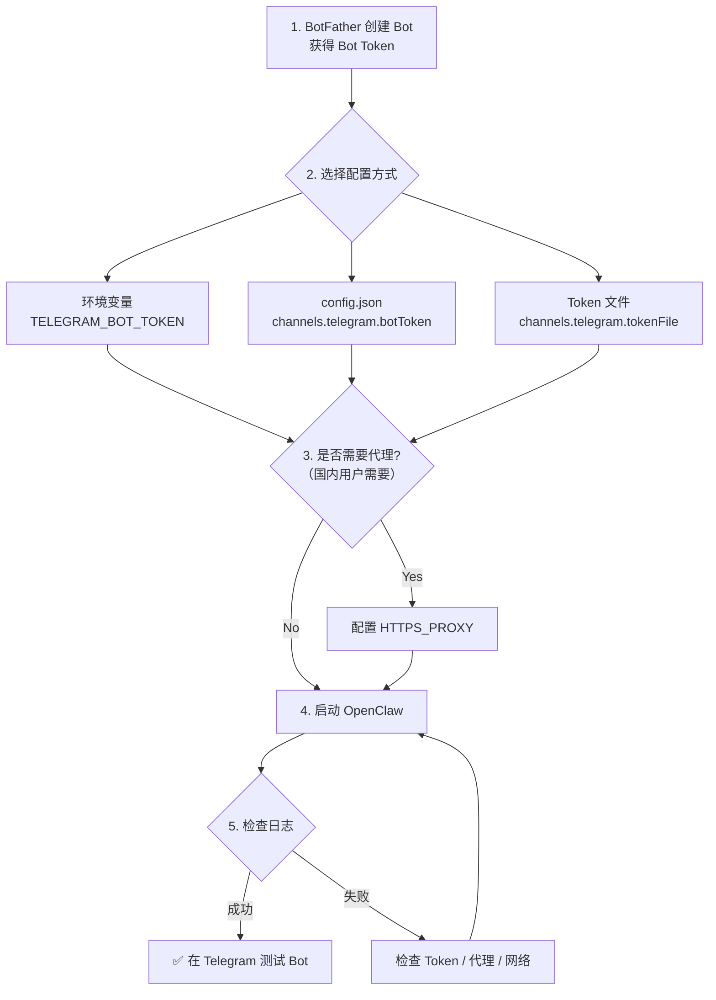

# Telegram Bot 配置流程

从零开始创建 Telegram Bot 并接入 OpenClaw 的完整步骤。

---

## 第一步：通过 BotFather 创建 Bot

1. 在 Telegram 中搜索 **@BotFather** 并打开对话
2. 发送 `/newbot`
3. 按提示输入：
   - **Bot 名称**（显示名）：如 `My AI Assistant`
   - **Bot 用户名**（唯一标识，必须以 `bot` 结尾）：如 `my_ai_assistant_bot`
4. 创建成功后，BotFather 会返回一个 **Bot Token**，格式如：
   ```
   123456789:ABCDefGHIjklMNOpqrSTUvwxYZ
   ```
5. **保存好这个 Token**，后续配置需要用到

### 可选设置（通过 BotFather）

| 命令 | 用途 |
|------|------|
| `/setdescription` | 设置 Bot 描述（用户点开 Bot 时看到的介绍） |
| `/setabouttext` | 设置 Bot 简介 |
| `/setuserpic` | 设置 Bot 头像 |
| `/setcommands` | 设置 Bot 命令菜单 |
| `/setprivacy` | 设置隐私模式（是否读取群聊消息） |

---

## 第二步：配置 OpenClaw

选择以下任一方式配置 Bot Token：

### 方式 A：环境变量（推荐，最简单）

```bash
export TELEGRAM_BOT_TOKEN="123456789:ABCDefGHIjklMNOpqrSTUvwxYZ"
```

### 方式 B：config.json

```json
{
  "channels": {
    "telegram": {
      "botToken": "123456789:ABCDefGHIjklMNOpqrSTUvwxYZ"
    }
  }
}
```

### 方式 C：Token 文件（适合 Docker/K8s Secrets）

```json
{
  "channels": {
    "telegram": {
      "tokenFile": "/run/secrets/telegram_bot_token"
    }
  }
}
```

> [!TIP]
> Token 解析优先级：`tokenFile` → `botToken`(config) → `TELEGRAM_BOT_TOKEN`(env)

---

## 第三步：代理配置（国内用户必看）

由于 Telegram API (`api.telegram.org`) 在国内无法直接访问，需要配置代理：

```bash
# 任选其一，按优先级 HTTPS_PROXY > HTTP_PROXY > ALL_PROXY
export HTTPS_PROXY="http://127.0.0.1:7890"
# 或
export HTTP_PROXY="http://127.0.0.1:7890"
# 或
export ALL_PROXY="socks5://127.0.0.1:1080"
```

> [!IMPORTANT]
> 未配置代理时，国内服务器将无法连接 Telegram API，Bot 不会启动。

---

## 第四步：启动并验证

1. **启动 OpenClaw**：
   ```bash
   cd openclaw-java
   mvn spring-boot:run -pl openclaw-app
   ```

2. **检查启动日志**，确认以下关键行出现：
   ```
   Initializing Telegram channel plugin
   Telegram channel plugin initialized for account: default
   ```

3. **测试 Bot**：在 Telegram 中找到你的 Bot，发送任意消息，确认收到回复

---

## 第五步：多账户配置（可选）

如需运行多个 Telegram Bot 实例：

```json
{
  "channels": {
    "telegram": {
      "accounts": {
        "default": {
          "botToken": "123456789:first_bot_token",
          "accountId": "main-bot"
        },
        "secondary": {
          "botToken": "987654321:second_bot_token",
          "accountId": "support-bot"
        }
      }
    }
  }
}
```

---

## 第六步：网络调优（可选）

```json
{
  "channels": {
    "telegram": {
      "botToken": "...",
      "connectTimeoutMs": 30000,
      "readTimeoutMs": 60000,
      "autoSelectFamily": true
    }
  }
}
```

| 参数 | 默认值 | 说明 |
|------|--------|------|
| `connectTimeoutMs` | `30000` | 连接超时（ms） |
| `readTimeoutMs` | `60000` | 读取超时（ms） |
| `autoSelectFamily` | `null` | IPv4/IPv6 自动选择 |

---

## 第七步：用户白名单配置（推荐）

通过 `allowFrom` 限制哪些用户可以与 Bot 互动。**未配置白名单时，所有用户均可使用 Bot。**

### 基本配置

```json
{
  "channels": {
    "providers": {
      "telegram": {
        "botToken": "...",
        "allowFrom": [
          "8252085335"
        ]
      }
    }
  }
}
```

### 支持的白名单格式

| 格式 | 示例 | 说明 |
|------|------|------|
| 用户 ID | `"123456789"` | Telegram 数字 ID（最精确） |
| 用户名 | `"@john_doe"` | Telegram 用户名（不区分大小写） |
| 用户名（无@） | `"john_doe"` | 同上，@ 前缀可省略 |
| 带前缀 ID | `"tg:123456789"` | 自动去除 `tg:` / `telegram:` 前缀 |
| 通配符 | `"*"` | 允许所有用户（等同于不配白名单） |

> [!TIP]
> 获取用户 ID：让目标用户向 [@userinfobot](https://t.me/userinfobot) 发送消息，即可获得数字 ID。用户名可能变更，建议优先使用 ID。

### 群聊白名单

可以单独配置群聊中的白名单（`groupAllowFrom`），控制群内谁可以触发 Bot：

```json
{
  "channels": {
    "providers": {
      "telegram": {
        "botToken": "...",
        "allowFrom": ["123456789"],
        "groupAllowFrom": ["123456789", "@admin_user"]
      }
    }
  }
}
```

| 字段 | 作用范围 | 说明 |
|------|----------|------|
| `allowFrom` | 私聊（DM） | 限制谁可以和 Bot 私聊 |
| `groupAllowFrom` | 群聊 | 限制群内谁可以触发 Bot |

### 白名单行为

| 场景 | 行为 |
|------|------|
| 未配置 `allowFrom` | 所有用户都可以使用 Bot |
| `allowFrom` 为空数组 `[]` | 所有用户都可以使用 Bot |
| `allowFrom` 包含 `"*"` | 允许所有用户（通配符） |
| `allowFrom` 包含具体用户 | 仅白名单中的用户可以使用 |
| 用户不在白名单中 | Bot 忽略该用户的消息（静默丢弃） |

### 多账户白名单

每个 Bot 账户可以有独立的白名单：

```json
{
  "channels": {
    "providers": {
      "telegram": {
        "accounts": {
          "default": {
            "botToken": "...",
            "allowFrom": ["123456789"]
          },
          "support": {
            "botToken": "...",
            "allowFrom": ["*"]
          }
        }
      }
    }
  }
}
```

---

## 常见问题排查

| 症状 | 原因 | 解决方案 |
|------|------|----------|
| 启动日志无 Telegram 初始化信息 | Token 未配置 | 检查环境变量或 config.json |
| `No Telegram bot token found` | Token 为空或格式错误 | 确认 Token 格式 `数字:字符串` |
| Bot 不回复消息 | 代理未配置（国内） | 设置 `HTTPS_PROXY` 环境变量 |
| Bot 不回复特定用户 | 用户不在白名单中 | 将用户 ID 或用户名加入 `allowFrom` |
| `Connection refused` | 代理地址/端口错误 | 确认代理服务正在运行 |
| Bot 回复延迟很高 | 网络超时设置过短 | 增大 `readTimeoutMs` |

---

## 配置流程图


