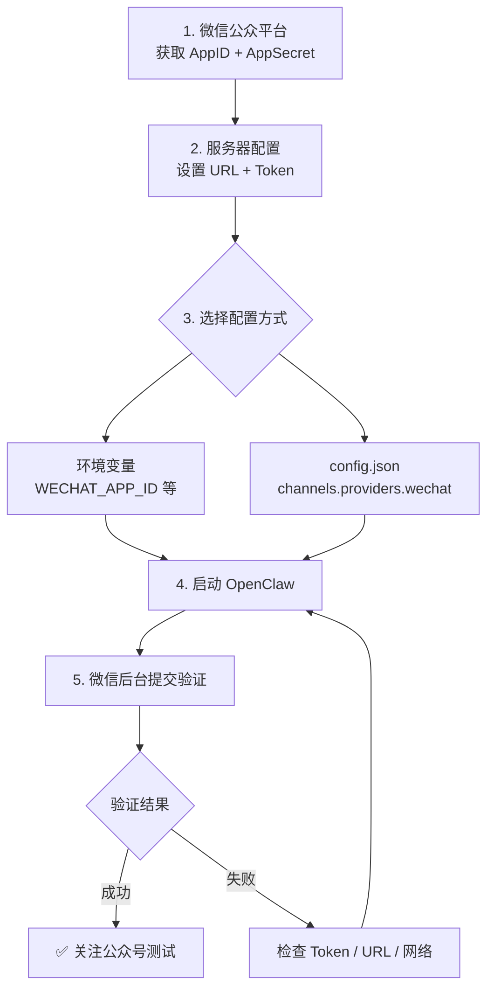

# 微信公众号配置流程

从零开始接入微信公众号（服务号）到 OpenClaw 的完整步骤。

---

## 前置条件

- **微信服务号**（订阅号不支持主动回复 API）
- 已完成微信认证
- 一台有公网 IP 的服务器（用于接收微信回调）

---

## 第一步：获取公众号凭据

1. 登录 [微信公众平台](https://mp.weixin.qq.com)
2. 进入 **设置与开发** → **基本配置**
3. 记录以下信息：

| 字段 | 说明 |
|------|------|
| **AppID** | 开发者 ID |
| **AppSecret** | 开发者密码（点击"重置"获取，仅显示一次） |

---

## 第二步：配置服务器 URL

在微信公众平台 **基本配置** → **服务器配置** 中：

| 配置项 | 值 |
|--------|-----|
| **URL** | `https://your-server.com/wechat-webhook` |
| **Token** | 自定义字符串（如 `my_wechat_token_2024`） |
| **EncodingAESKey** | 随机生成（可点击"随机生成"按钮） |
| **消息加解密方式** | 建议选 **安全模式** |

> [!IMPORTANT]
> 先完成第三步（配置 OpenClaw 并启动），再点击"提交"验证。

---

## 第三步：配置 OpenClaw

选择以下任一方式：

### 方式 A：环境变量（推荐）

```bash
export WECHAT_APP_ID="wx1234567890abcdef"
export WECHAT_APP_SECRET="your_app_secret"
export WECHAT_TOKEN="my_wechat_token_2024"
export WECHAT_ENCODING_AES_KEY="your_encoding_aes_key"  # 可选
```

### 方式 B：config.json

```json
{
  "channels": {
    "providers": {
      "wechat": {
        "appId": "wx1234567890abcdef",
        "appSecret": "your_app_secret",
        "token": "my_wechat_token_2024",
        "encodingAesKey": "your_encoding_aes_key"
      }
    }
  }
}
```

> [!TIP]
> 配置解析优先级：config.json 字段 → 环境变量

---

## 第四步：启动并验证

1. **启动 OpenClaw**：
   ```bash
   cd openclaw-java
   mvn spring-boot:run -pl openclaw-app
   ```

2. **检查启动日志**，确认以下关键行出现：
   ```
   WeChat channel plugin initialized for appId: wx1234567890abcdef
   WeChat webhook routes registered at /wechat-webhook
   ```

3. **回到微信公众平台**，点击 **服务器配置** → **提交**
   - 微信会向 `https://your-server.com/wechat-webhook` 发送 GET 验证请求
   - 验证通过后启用配置

4. **测试**：关注公众号，发送消息，确认收到回复

---

## 配置参数说明

| 参数 | 环境变量 | 必填 | 说明 |
|------|----------|------|------|
| `appId` | `WECHAT_APP_ID` | ✅ | 公众号 AppID |
| `appSecret` | `WECHAT_APP_SECRET` | ✅ | 公众号 AppSecret |
| `token` | `WECHAT_TOKEN` | ✅ | 服务器验证 Token（需与微信后台一致） |
| `encodingAesKey` | `WECHAT_ENCODING_AES_KEY` | ❌ | 消息加密密钥（安全模式需要） |

---

## Webhook 端点

| 方法 | 路径 | 用途 |
|------|------|------|
| `GET` | `/wechat-webhook` | 微信服务器验证（signature + echostr） |
| `POST` | `/wechat-webhook` | 接收用户消息（XML 格式） |

---

## 常见问题排查

| 症状 | 原因 | 解决方案 |
|------|------|----------|
| 启动日志无 WeChat 初始化信息 | AppID/AppSecret 未配置 | 检查环境变量或 config.json |
| 微信验证 Token 失败 | Token 不匹配 | 确认 OpenClaw 和微信后台的 Token 一致 |
| 验证通过但不回复消息 | 消息处理异常 | 检查服务器日志中的报错 |
| `access_token` 获取失败 | AppSecret 错误或 IP 白名单 | 在微信后台添加服务器 IP 白名单 |
| 回复超时（5 秒限制） | AI 模型响应慢 | 微信要求 5 秒内回复，超时不显示 |

> [!WARNING]
> 微信要求 5 秒内回复，否则用户看不到消息。如果 AI 模型响应较慢，需要实现异步回复（通过客服消息接口）。

---

## 配置流程图


